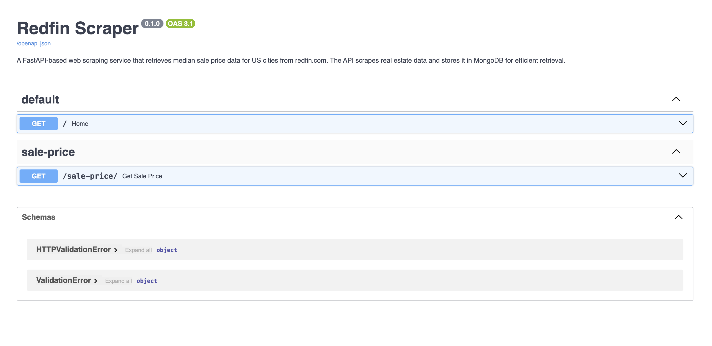
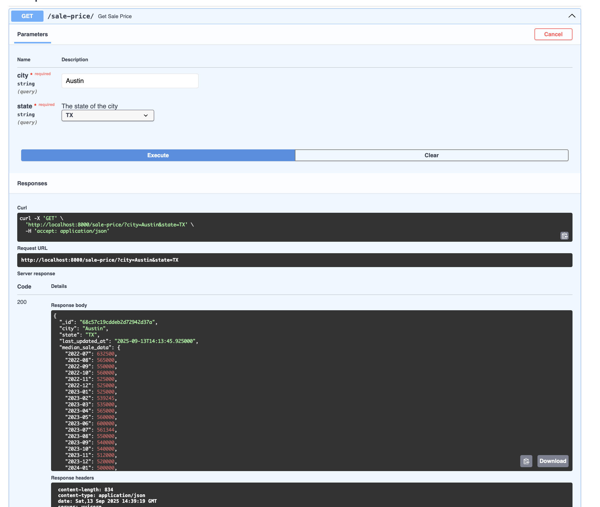
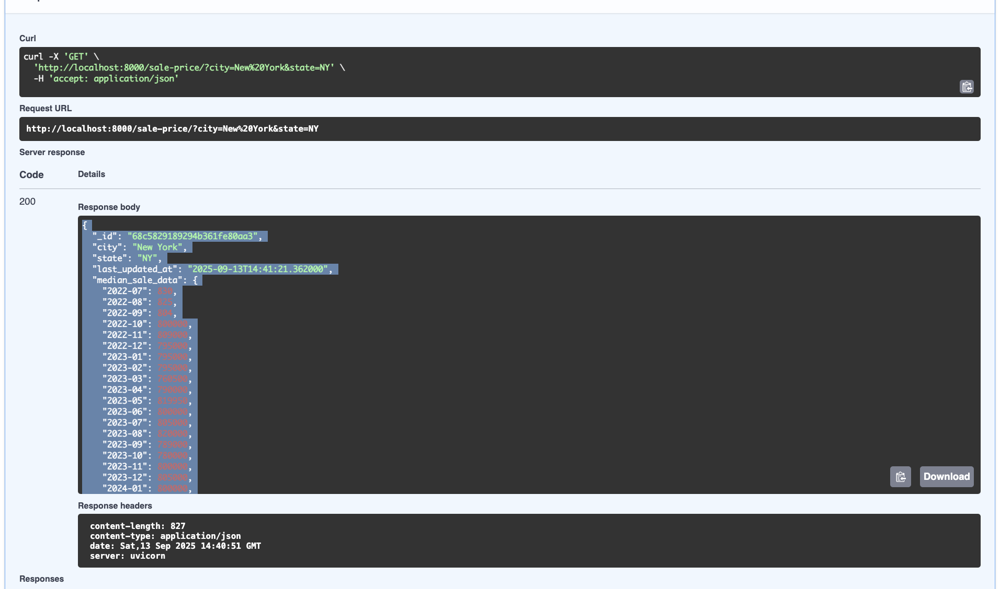

# API Examples and Screenshots

This document provides visual examples and detailed output of the Redfin Scrape API in action.

## Table of Contents
- [API Documentation Screenshots](#api-documentation-screenshots)
- [API Response Examples](#api-response-examples)
- [Error Handling Examples](#error-handling-examples)
- [Testing with Different Cities](#testing-with-different-cities)

## API Documentation Screenshots

### 1. Swagger UI Homepage

*Access the interactive API documentation at `http://localhost:8000/docs`*

### 2. API Endpoints Overview

*Available endpoints in the Swagger UI interface*

### 3. Sale Price Endpoint Details

*Detailed view of the `/sale-price/` endpoint with parameters*

### 4. Request/Response Schema

*Schema definitions for request and response models*

## API Response Examples

### Successful Response - Austin, TX

**Request:**
```bash
curl "http://localhost:8000/sale-price/?city=Austin&state=TX"
```

**Response:**
```json
{
  "_id": "68c57c19cddeb2d72942d37a",
  "city": "Austin",
  "state": "TX",
  "last_updated_at": "2025-09-13T14:13:45.925000",
  "median_sale_data": {
    "2022-07": 632500,
    "2022-08": 565000,
    "2022-09": 550000,
    "2022-10": 560000,
    "2022-11": 525000,
    "2022-12": 525000,
    "2023-01": 525000,
    "2023-02": 539245,
    "2023-03": 535000,
    "2023-04": 565000,
    "2023-05": 560000,
    "2023-06": 600000,
    "2023-07": 561344,
    "2023-08": 550000,
    "2023-09": 540000,
    "2023-10": 540000,
    "2023-11": 512000,
    "2023-12": 520000,
    "2024-01": 500000,
    "2024-02": 522000,
    "2024-03": 549995,
    "2024-04": 561250,
    "2024-05": 586000,
    "2024-06": 555000,
    "2024-07": 542500,
    "2024-08": 535000,
    "2024-09": 560000,
    "2024-10": 540000,
    "2024-11": 546000,
    "2024-12": 535000,
    "2025-01": 517580,
    "2025-02": 517500,
    "2025-03": 545417,
    "2025-04": 575000,
    "2025-05": 555000,
    "2025-06": 559052,
    "2025-07": 555000
  }
}
```

**Screenshot of Response:**


### Successful Response - New York, NY

**Request:**
```bash
curl "http://localhost:8000/sale-price/?city=New York&state=NY"
```

**Response:**
```json
{
  "_id": "68c5829189294b361fe80aa3",
  "city": "New York",
  "state": "NY",
  "last_updated_at": "2025-09-13T14:41:21.362000",
  "median_sale_data": {
    "2022-07": 830,
    "2022-08": 825,
    "2022-09": 804,
    "2022-10": 800000,
    "2022-11": 809000,
    "2022-12": 795000,
    "2023-01": 795000,
    "2023-02": 795000,
    "2023-03": 760500,
    "2023-04": 790000,
    "2023-05": 819950,
    "2023-06": 800000,
    "2023-07": 805000,
    "2023-08": 820000,
    "2023-09": 789000,
    "2023-10": 780000,
    "2023-11": 800000,
    "2023-12": 805000,
    "2024-01": 800000,
    "2024-02": 782000,
    "2024-03": 800000,
    "2024-04": 837750,
    "2024-05": 809004,
    "2024-06": 850004,
    "2024-07": 860000,
    "2024-08": 816000,
    "2024-09": 810000,
    "2024-10": 805575,
    "2024-11": 812000,
    "2024-12": 849000,
    "2025-01": 854209,
    "2025-02": 860000,
    "2025-03": 825000,
    "2025-04": 850000,
    "2025-05": 879500,
    "2025-06": 882000,
    "2025-07": 899000
  }
}
```

**Screenshot of Response:**


### Scraping Failure Error

**Request:**
```bash
curl "http://localhost:8000/sale-price/?city=NonExistentCity&state=CA"
```

**Response:**
```json
{
  "detail": "Invalid city or state provided. Please try again with a valid US city and state."
}
```
